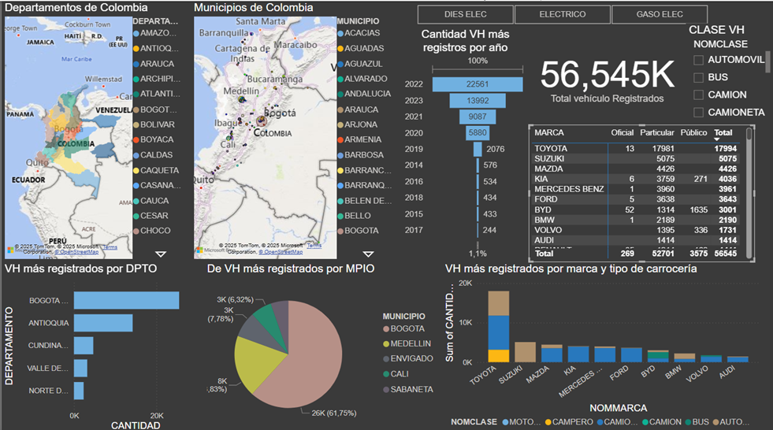
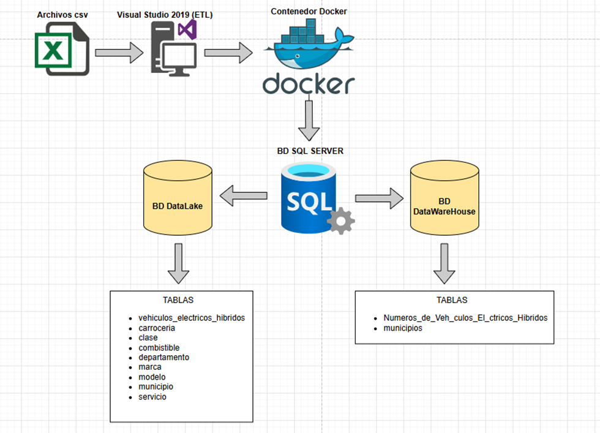
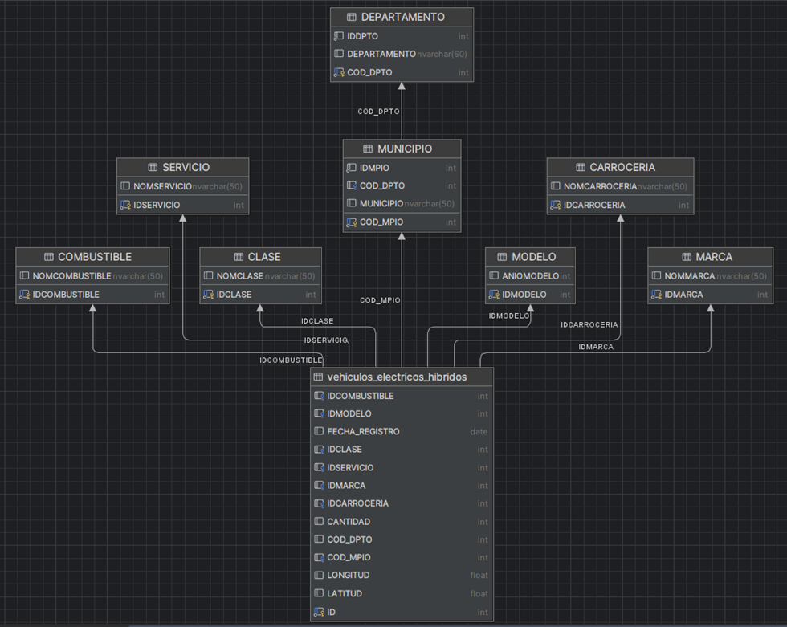
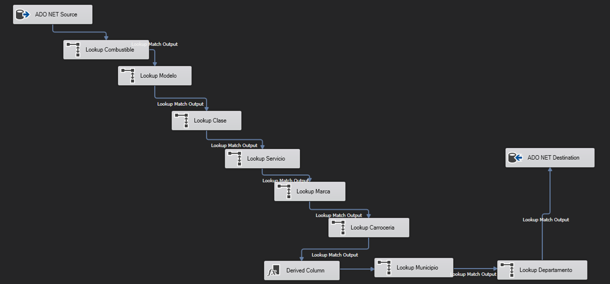

## 📊 Electric Vehicles Analysis - Colombia

Descripción:
Este proyecto analiza el comportamiento de la matrícula de vehículos eléctricos e híbridos en Colombia durante los últimos 13 años.

Objetivo:
Identificar tendencias, marcas líderes y distribución geográfica para apoyar la toma de decisiones.

Herramientas:
Power BI
Excel / Datos abiertos Colombia

Principales insights:
Bogotá concentra el 61.75% de registros
Crecimiento impulsado por incentivos fiscales
Marcas líderes: Toyota, Suzuki, Mazda

Dashboard:

## 🧠 Key Insights
- Bogotá concentra el 61.75% de los registros
- Crecimiento impulsado por incentivos fiscales
- Marcas líderes: Toyota, Suzuki, Mazda

## 🏗️ Data Architecture
The data pipeline was designed to ingest, transform, and store data efficiently.

- Source: CSV files
- ETL: Visual Studio 2019 (SSIS)
- Storage: SQL Server (Docker)
- Layers: Data Lake and Data Warehouse

## 🏛️ Data Model
A star schema was implemented to optimize analytical queries and reporting.
The fact table stores vehicle registration data, while dimension tables provide descriptive attributes such as brand, model, location, and vehicle type.

## 🔄 ETL Process

The ETL process was developed using SQL Server Integration Services (SSIS).

- Data extraction from source systems
- Data transformation using lookup components
- Data loading into the Data Warehouse

## 🛠️ Tools

- Power BI
- SQL Server
- Docker
- Visual Studio 2019 (SSIS)
- Excel

